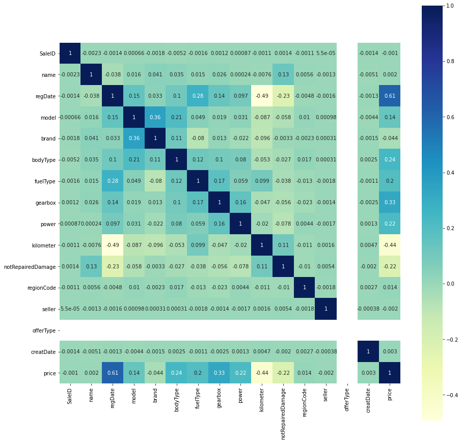

## 指标评价

#### 分类算法常见的评估指标如下：

* 对于二类分类器/分类算法，评价指标主要有accuracy， [Precision，Recall，F-score，Pr曲线]，ROC-AUC曲线。
* 对于多类分类器/分类算法，评价指标主要有accuracy， [宏平均和微平均，F-score]。

#### 对于回归预测类常见的评估指标如下:

* 平均绝对误差（Mean Absolute Error，MAE），均方误差（Mean Squared Error，MSE），平均绝对百分误差（Mean Absolute Percentage Error，MAPE），均方根误差（Root Mean Squared Error）， R2（R-Square）

**平均绝对误差**
**平均绝对误差（Mean Absolute Error，MAE）**:平均绝对误差，其能更好地反映预测值与真实值误差的实际情况，其计算公式如下：
$$
MAE=\frac{1}{N} \sum_{i=1}^{N}\left|y_{i}-\hat{y}_{i}\right|
$$

**均方误差**
**均方误差（Mean Squared Error，MSE）**,均方误差,其计算公式为：
$$
MSE=\frac{1}{N} \sum_{i=1}^{N}\left(y_{i}-\hat{y}_{i}\right)^{2}
$$

**R2（R-Square）的公式为**：
残差平方和：
$$
SS_{res}=\sum\left(y_{i}-\hat{y}_{i}\right)^{2}
$$
总平均值:
$$
SS_{tot}=\sum\left(y_{i}-\overline{y}_{i}\right)^{2}
$$

其中$\overline{y}$表示$y$的平均值
得到$R^2$表达式为：
$$
R^{2}=1-\frac{SS_{res}}{SS_{tot}}=1-\frac{\sum\left(y_{i}-\hat{y}_{i}\right)^{2}}{\sum\left(y_{i}-\overline{y}\right)^{2}}
$$
$R^2$用于度量因变量的变异中可由自变量解释部分所占的比例，取值范围是 0~1，$R^2$越接近1,表明回归平方和占总平方和的比例越大,回归线与各观测点越接近，用x的变化来解释y值变化的部分就越多,回归的拟合程度就越好。所以$R^2$也称为拟合优度（Goodness of Fit）的统计量。

$y_{i}$表示真实值，$\hat{y}_{i}$表示预测值，$\overline{y}_{i}$表示样本均值。得分越高拟合效果越好。

**1. 分类指标**


```python
from sklearn import metrics

y_pred = [0, 1, 0, 1]
y_true = [0, 1, 1, 1]
y_scores = np.array([0.1, 0.65, 0.75, 0.1])
print('ACC:',metrics.accuracy_score(y_true, y_pred))
print('Precision',metrics.precision_score(y_true, y_pred))
print('Recall',metrics.recall_score(y_true, y_pred))
print('F1-score:',metrics.f1_score(y_true, y_pred))
print('AUC socre:',metrics.roc_auc_score(y_true, y_scores))
```

    ACC: 0.75
    Precision 1.0
    Recall 0.6666666666666666
    F1-score: 0.8
    AUC socre: 0.8333333333333333
    


```python
# 根据定义自建函数
class Mymetrics:
    
    # 准确率
    def accuracy_score(y_true, y_pred):
        assert len(y_true) == len(y_pred), "len(y_pred) must equal len(y_true)"
        return np.sum(np.equal(y_pred, y_true)) / len(y_pred)
    
    # 精确率
    def precision_score(y_true, y_pred):
        assert len(y_true) == len(y_pred), "len(y_pred) must equal len(y_true)"
        return sum(j == i == 1 for i,j in zip(y_pred, y_true)) / np.sum(y_pred)
    
    # 召回率
    def recall_score(y_true, y_pred):
        assert len(y_true) == len(y_pred), "len(y_pred) must equal len(y_true)"
        return sum(j == i == 1 for i,j in zip(y_pred, y_true)) / np.sum(y_true)
    
    # F1-score
    def f1_score(y_true, y_pred):
        assert len(y_true) == len(y_pred), "len(y_pred) must equal len(y_true)"
        return 2 / (1 / Mymetrics.precision_score(y_true, y_pred) + 1 / Mymetrics.recall_score(y_true, y_pred))
    
y_pred = [0, 1, 0, 1]
y_true = [0, 1, 1, 1]
print('ACC:',Mymetrics.accuracy_score(y_true, y_pred))
print('Precision',Mymetrics.precision_score(y_true, y_pred))
print('Recall',Mymetrics.recall_score(y_true, y_pred))
print('F1-score:',Mymetrics.f1_score(y_true, y_pred))
```

    ACC: 0.75
    Precision 1.0
    Recall 0.6666666666666666
    F1-score: 0.8
    

<font color='red'>AUC的计算函数暂时不知道怎么写！</font>

**2.回归指标评价计算示例**


```python
import numpy as np
from sklearn import metrics

# MAPE需要自己实现
def mape(y_true, y_pred):
    return np.mean(np.abs((y_pred - y_true) / y_true))

y_true = np.array([1.0, 5.0, 4.0, 3.0, 2.0, 5.0, -3.0])
y_pred = np.array([1.0, 4.5, 3.8, 3.2, 3.0, 4.8, -2.2])

# MSE
print('MSE:',metrics.mean_squared_error(y_true, y_pred))
# RMSE
print('RMSE:',np.sqrt(metrics.mean_squared_error(y_true, y_pred)))
# MAE
print('MAE:',metrics.mean_absolute_error(y_true, y_pred))
# MAPE
print('MAPE:',mape(y_true, y_pred))
# R2-score
print('R2-score:',metrics.r2_score(y_true, y_pred))
```

    MSE: 0.2871428571428571
    RMSE: 0.5358571238146014
    MAE: 0.4142857142857143
    MAPE: 0.1461904761904762
    R2-score: 0.957874251497006
    


```python
# 根据定义自建函数
class Mymetrics(Mymetrics):
    
    # 均方差
    def mean_squared_error(y_true, y_pred):
        assert len(y_true) == len(y_pred), "len(y_pred) must equal len(y_true)"
        return np.mean(np.square(y_true - y_pred))
    
    # 均方根误差
    def r_mean_squared_error(y_true, y_pred):
        assert len(y_true) == len(y_pred), "len(y_pred) must equal len(y_true)"
        return np.sqrt(Mymetrics.mean_squared_error(y_true, y_pred))
    
    # 平均绝对误差
    def mean_absolute_error(y_true, y_pred):
        assert len(y_true) == len(y_pred), "len(y_pred) must equal len(y_true)"
        return np.mean(np.abs(y_true - y_pred))
    
    # 平均绝对百分误差
    def mean_absolute_percent_error(y_true, y_pred):
        assert len(y_true) == len(y_pred), "len(y_pred) must equal len(y_true)"
        return np.mean(np.abs((y_true - y_pred) / y_true))
    
    # R方
    def r2_score(y_true, y_pred):
        assert len(y_true) == len(y_pred), "len(y_pred) must equal len(y_true)"
        return 1 - np.sum(np.square(y_true - y_pred)) / np.sum(np.square(y_true - np.mean(y_true)))
    
y_true = np.array([1.0, 5.0, 4.0, 3.0, 2.0, 5.0, -3.0])
y_pred = np.array([1.0, 4.5, 3.8, 3.2, 3.0, 4.8, -2.2])

# MSE
print('MSE:',Mymetrics.mean_squared_error(y_true, y_pred))
# RMSE
print('RMSE:',Mymetrics.r_mean_squared_error(y_true, y_pred))
# MAE
print('MAE:',Mymetrics.mean_absolute_error(y_true, y_pred))
# MAPE
print('MAPE:',Mymetrics.mean_absolute_percent_error(y_true, y_pred))
# R2-score
print('R2-score:',Mymetrics.r2_score(y_true, y_pred))
```

    MSE: 0.2871428571428571
    RMSE: 0.5358571238146014
    MAE: 0.4142857142857143
    MAPE: 0.1461904761904762
    R2-score: 0.957874251497006
    

### 赛题数据分析


```python
import os
from zipfile import ZipFile
import pandas as pd
import numpy as np
import matplotlib.pyplot as plt
%matplotlib inline
import seaborn as sns
```

### 1. 读取数据


```python
def load_data(filename = 'used_car_train_20200313', sep = ' '):
    myzip=ZipFile('data/%s.zip'%filename)
    f = myzip.open('%s.csv'%filename)
    Train_data = pd.read_csv(f, sep=sep)
    f.close()
    myzip.close()
    return Train_data

Train_data = load_data('used_car_train_20200313')
Test_data = load_data('used_car_testA_20200313')
print(Train_data.shape, Test_data.shape)
```

    (150000, 31) (50000, 30)
    

### 2. 查看数据概况

* name - 汽车编码
* regDate - 汽车注册时间
* model - 车型编码
* brand - 品牌
* bodyType - 车身类型
* fuelType - 燃油类型
* gearbox - 变速箱
* power - 汽车功率
* kilometer - 汽车行驶公里
* notRepairedDamage - 汽车有尚未修复的损坏
* regionCode - 看车地区编码
* seller - 销售方
* offerType - 报价类型
* creatDate - 广告发布时间
* price - 汽车价格
* v_0', 'v_1', 'v_2', 'v_3', 'v_4', 'v_5', 'v_6', 'v_7', 'v_8', 'v_9', 'v_10', 'v_11', 'v_12', 'v_13','v_14'（根据汽车的评论、标签等大量信息得到的embedding向量）【人工构造 匿名特征】

#### 2.1 查看数据表中的值


```python
Train_data.head()
```


<div>
<style scoped>
    .dataframe tbody tr th:only-of-type {
        vertical-align: middle;
    }

    .dataframe tbody tr th {
        vertical-align: top;
    }

    .dataframe thead th {
        text-align: right;
    }
</style>
<table border="1" class="dataframe">
  <thead>
    <tr style="text-align: right;">
      <th></th>
      <th>SaleID</th>
      <th>name</th>
      <th>regDate</th>
      <th>model</th>
      <th>brand</th>
      <th>bodyType</th>
      <th>fuelType</th>
      <th>gearbox</th>
      <th>power</th>
      <th>kilometer</th>
      <th>...</th>
      <th>v_5</th>
      <th>v_6</th>
      <th>v_7</th>
      <th>v_8</th>
      <th>v_9</th>
      <th>v_10</th>
      <th>v_11</th>
      <th>v_12</th>
      <th>v_13</th>
      <th>v_14</th>
    </tr>
  </thead>
  <tbody>
    <tr>
      <th>0</th>
      <td>0</td>
      <td>736</td>
      <td>20040402</td>
      <td>30.0</td>
      <td>6</td>
      <td>1.0</td>
      <td>0.0</td>
      <td>0.0</td>
      <td>60</td>
      <td>12.5</td>
      <td>...</td>
      <td>0.235676</td>
      <td>0.101988</td>
      <td>0.129549</td>
      <td>0.022816</td>
      <td>0.097462</td>
      <td>-2.881803</td>
      <td>2.804097</td>
      <td>-2.420821</td>
      <td>0.795292</td>
      <td>0.914762</td>
    </tr>
    <tr>
      <th>1</th>
      <td>1</td>
      <td>2262</td>
      <td>20030301</td>
      <td>40.0</td>
      <td>1</td>
      <td>2.0</td>
      <td>0.0</td>
      <td>0.0</td>
      <td>0</td>
      <td>15.0</td>
      <td>...</td>
      <td>0.264777</td>
      <td>0.121004</td>
      <td>0.135731</td>
      <td>0.026597</td>
      <td>0.020582</td>
      <td>-4.900482</td>
      <td>2.096338</td>
      <td>-1.030483</td>
      <td>-1.722674</td>
      <td>0.245522</td>
    </tr>
    <tr>
      <th>2</th>
      <td>2</td>
      <td>14874</td>
      <td>20040403</td>
      <td>115.0</td>
      <td>15</td>
      <td>1.0</td>
      <td>0.0</td>
      <td>0.0</td>
      <td>163</td>
      <td>12.5</td>
      <td>...</td>
      <td>0.251410</td>
      <td>0.114912</td>
      <td>0.165147</td>
      <td>0.062173</td>
      <td>0.027075</td>
      <td>-4.846749</td>
      <td>1.803559</td>
      <td>1.565330</td>
      <td>-0.832687</td>
      <td>-0.229963</td>
    </tr>
    <tr>
      <th>3</th>
      <td>3</td>
      <td>71865</td>
      <td>19960908</td>
      <td>109.0</td>
      <td>10</td>
      <td>0.0</td>
      <td>0.0</td>
      <td>1.0</td>
      <td>193</td>
      <td>15.0</td>
      <td>...</td>
      <td>0.274293</td>
      <td>0.110300</td>
      <td>0.121964</td>
      <td>0.033395</td>
      <td>0.000000</td>
      <td>-4.509599</td>
      <td>1.285940</td>
      <td>-0.501868</td>
      <td>-2.438353</td>
      <td>-0.478699</td>
    </tr>
    <tr>
      <th>4</th>
      <td>4</td>
      <td>111080</td>
      <td>20120103</td>
      <td>110.0</td>
      <td>5</td>
      <td>1.0</td>
      <td>0.0</td>
      <td>0.0</td>
      <td>68</td>
      <td>5.0</td>
      <td>...</td>
      <td>0.228036</td>
      <td>0.073205</td>
      <td>0.091880</td>
      <td>0.078819</td>
      <td>0.121534</td>
      <td>-1.896240</td>
      <td>0.910783</td>
      <td>0.931110</td>
      <td>2.834518</td>
      <td>1.923482</td>
    </tr>
  </tbody>
</table>
<p>5 rows × 31 columns</p>
</div>


#### 2.2 数据信息


```python
Train_data.info()
```

    <class 'pandas.core.frame.DataFrame'>
    RangeIndex: 150000 entries, 0 to 149999
    Data columns (total 31 columns):
     #   Column             Non-Null Count   Dtype  
    ---  ------             --------------   -----  
     0   SaleID             150000 non-null  int64  
     1   name               150000 non-null  int64  
     2   regDate            150000 non-null  int64  
     3   model              149999 non-null  float64
     4   brand              150000 non-null  int64  
     5   bodyType           145494 non-null  float64
     6   fuelType           141320 non-null  float64
     7   gearbox            144019 non-null  float64
     8   power              150000 non-null  int64  
     9   kilometer          150000 non-null  float64
     10  notRepairedDamage  150000 non-null  object 
     11  regionCode         150000 non-null  int64  
     12  seller             150000 non-null  int64  
     13  offerType          150000 non-null  int64  
     14  creatDate          150000 non-null  int64  
     15  price              150000 non-null  int64  
     16  v_0                150000 non-null  float64
     17  v_1                150000 non-null  float64
     18  v_2                150000 non-null  float64
     19  v_3                150000 non-null  float64
     20  v_4                150000 non-null  float64
     21  v_5                150000 non-null  float64
     22  v_6                150000 non-null  float64
     23  v_7                150000 non-null  float64
     24  v_8                150000 non-null  float64
     25  v_9                150000 non-null  float64
     26  v_10               150000 non-null  float64
     27  v_11               150000 non-null  float64
     28  v_12               150000 non-null  float64
     29  v_13               150000 non-null  float64
     30  v_14               150000 non-null  float64
    dtypes: float64(20), int64(10), object(1)
    memory usage: 35.5+ MB
    


```python
Train_data.notRepairedDamage = Train_data.notRepairedDamage.replace('-',2.0)
Train_data.notRepairedDamage = Train_data.notRepairedDamage.astype(float)
```

#### 2.3 数据描述


```python
Train_data.describe()
```


<div>
<style scoped>
    .dataframe tbody tr th:only-of-type {
        vertical-align: middle;
    }

    .dataframe tbody tr th {
        vertical-align: top;
    }

    .dataframe thead th {
        text-align: right;
    }
</style>
<table border="1" class="dataframe">
  <thead>
    <tr style="text-align: right;">
      <th></th>
      <th>SaleID</th>
      <th>name</th>
      <th>regDate</th>
      <th>model</th>
      <th>brand</th>
      <th>bodyType</th>
      <th>fuelType</th>
      <th>gearbox</th>
      <th>power</th>
      <th>kilometer</th>
      <th>...</th>
      <th>v_5</th>
      <th>v_6</th>
      <th>v_7</th>
      <th>v_8</th>
      <th>v_9</th>
      <th>v_10</th>
      <th>v_11</th>
      <th>v_12</th>
      <th>v_13</th>
      <th>v_14</th>
    </tr>
  </thead>
  <tbody>
    <tr>
      <th>count</th>
      <td>150000.000000</td>
      <td>150000.000000</td>
      <td>1.500000e+05</td>
      <td>149999.000000</td>
      <td>150000.000000</td>
      <td>145494.000000</td>
      <td>141320.000000</td>
      <td>144019.000000</td>
      <td>150000.000000</td>
      <td>150000.000000</td>
      <td>...</td>
      <td>150000.000000</td>
      <td>150000.000000</td>
      <td>150000.000000</td>
      <td>150000.000000</td>
      <td>150000.000000</td>
      <td>150000.000000</td>
      <td>150000.000000</td>
      <td>150000.000000</td>
      <td>150000.000000</td>
      <td>150000.000000</td>
    </tr>
    <tr>
      <th>mean</th>
      <td>74999.500000</td>
      <td>68349.172873</td>
      <td>2.003417e+07</td>
      <td>47.129021</td>
      <td>8.052733</td>
      <td>1.792369</td>
      <td>0.375842</td>
      <td>0.224943</td>
      <td>119.316547</td>
      <td>12.597160</td>
      <td>...</td>
      <td>0.248204</td>
      <td>0.044923</td>
      <td>0.124692</td>
      <td>0.058144</td>
      <td>0.061996</td>
      <td>-0.001000</td>
      <td>0.009035</td>
      <td>0.004813</td>
      <td>0.000313</td>
      <td>-0.000688</td>
    </tr>
    <tr>
      <th>std</th>
      <td>43301.414527</td>
      <td>61103.875095</td>
      <td>5.364988e+04</td>
      <td>49.536040</td>
      <td>7.864956</td>
      <td>1.760640</td>
      <td>0.548677</td>
      <td>0.417546</td>
      <td>177.168419</td>
      <td>3.919576</td>
      <td>...</td>
      <td>0.045804</td>
      <td>0.051743</td>
      <td>0.201410</td>
      <td>0.029186</td>
      <td>0.035692</td>
      <td>3.772386</td>
      <td>3.286071</td>
      <td>2.517478</td>
      <td>1.288988</td>
      <td>1.038685</td>
    </tr>
    <tr>
      <th>min</th>
      <td>0.000000</td>
      <td>0.000000</td>
      <td>1.991000e+07</td>
      <td>0.000000</td>
      <td>0.000000</td>
      <td>0.000000</td>
      <td>0.000000</td>
      <td>0.000000</td>
      <td>0.000000</td>
      <td>0.500000</td>
      <td>...</td>
      <td>0.000000</td>
      <td>0.000000</td>
      <td>0.000000</td>
      <td>0.000000</td>
      <td>0.000000</td>
      <td>-9.168192</td>
      <td>-5.558207</td>
      <td>-9.639552</td>
      <td>-4.153899</td>
      <td>-6.546556</td>
    </tr>
    <tr>
      <th>25%</th>
      <td>37499.750000</td>
      <td>11156.000000</td>
      <td>1.999091e+07</td>
      <td>10.000000</td>
      <td>1.000000</td>
      <td>0.000000</td>
      <td>0.000000</td>
      <td>0.000000</td>
      <td>75.000000</td>
      <td>12.500000</td>
      <td>...</td>
      <td>0.243615</td>
      <td>0.000038</td>
      <td>0.062474</td>
      <td>0.035334</td>
      <td>0.033930</td>
      <td>-3.722303</td>
      <td>-1.951543</td>
      <td>-1.871846</td>
      <td>-1.057789</td>
      <td>-0.437034</td>
    </tr>
    <tr>
      <th>50%</th>
      <td>74999.500000</td>
      <td>51638.000000</td>
      <td>2.003091e+07</td>
      <td>30.000000</td>
      <td>6.000000</td>
      <td>1.000000</td>
      <td>0.000000</td>
      <td>0.000000</td>
      <td>110.000000</td>
      <td>15.000000</td>
      <td>...</td>
      <td>0.257798</td>
      <td>0.000812</td>
      <td>0.095866</td>
      <td>0.057014</td>
      <td>0.058484</td>
      <td>1.624076</td>
      <td>-0.358053</td>
      <td>-0.130753</td>
      <td>-0.036245</td>
      <td>0.141246</td>
    </tr>
    <tr>
      <th>75%</th>
      <td>112499.250000</td>
      <td>118841.250000</td>
      <td>2.007111e+07</td>
      <td>66.000000</td>
      <td>13.000000</td>
      <td>3.000000</td>
      <td>1.000000</td>
      <td>0.000000</td>
      <td>150.000000</td>
      <td>15.000000</td>
      <td>...</td>
      <td>0.265297</td>
      <td>0.102009</td>
      <td>0.125243</td>
      <td>0.079382</td>
      <td>0.087491</td>
      <td>2.844357</td>
      <td>1.255022</td>
      <td>1.776933</td>
      <td>0.942813</td>
      <td>0.680378</td>
    </tr>
    <tr>
      <th>max</th>
      <td>149999.000000</td>
      <td>196812.000000</td>
      <td>2.015121e+07</td>
      <td>247.000000</td>
      <td>39.000000</td>
      <td>7.000000</td>
      <td>6.000000</td>
      <td>1.000000</td>
      <td>19312.000000</td>
      <td>15.000000</td>
      <td>...</td>
      <td>0.291838</td>
      <td>0.151420</td>
      <td>1.404936</td>
      <td>0.160791</td>
      <td>0.222787</td>
      <td>12.357011</td>
      <td>18.819042</td>
      <td>13.847792</td>
      <td>11.147669</td>
      <td>8.658418</td>
    </tr>
  </tbody>
</table>
<p>8 rows × 31 columns</p>
</div>


```python
from scipy import stats  
def Mydescribe(data, columns = None):
    data = np.array(data)
    if data.ndim == 1:
        data = np.array(data).reshape(-1,1)
    des = {}
    # 均值
    des['均值'] = data.mean(axis=0)
    # 分位数 0, 0.25, 0.5, 0.75, 1.0
    data_quantile = np.quantile(data, q=[0.,0.25,0.5,0.75,1.], axis = 0)
    # 方差
    des['方差'] = data.var(axis=0)
    # 标准差
    des['标准差'] = data.std(axis=0)
    # 极差
    des['极差'] = data.max(axis=0) - data.min(axis=0)
    # 四分位数
    des['四分位数'] = data_quantile[3,:] - data_quantile[1,:] 
    # 变异系数
    des['变异系数'] = des['标准差'] / des['均值']
    # 众数
    des['众数'] = stats.mode(data)[0][0]
    # 偏度
    data = pd.DataFrame(data)
    des['偏度'] = np.array(data.skew())
    # 峰度
    des['峰度'] = np.array(data.kurt())
    
    res = pd.DataFrame(des).T
    if columns is not None:
        res.columns = columns
    return res

Mydescribe(Train_data.dropna(how='any'), columns = Train_data.columns)
```

    <ipython-input-36-6f859b4241b7>:20: RuntimeWarning: invalid value encountered in true_divide
      des['变异系数'] = des['标准差'] / des['均值']
    


<div>
<style scoped>
    .dataframe tbody tr th:only-of-type {
        vertical-align: middle;
    }

    .dataframe tbody tr th {
        vertical-align: top;
    }

    .dataframe thead th {
        text-align: right;
    }
</style>
<table border="1" class="dataframe">
  <thead>
    <tr style="text-align: right;">
      <th></th>
      <th>SaleID</th>
      <th>name</th>
      <th>regDate</th>
      <th>model</th>
      <th>brand</th>
      <th>bodyType</th>
      <th>fuelType</th>
      <th>gearbox</th>
      <th>power</th>
      <th>kilometer</th>
      <th>...</th>
      <th>v_5</th>
      <th>v_6</th>
      <th>v_7</th>
      <th>v_8</th>
      <th>v_9</th>
      <th>v_10</th>
      <th>v_11</th>
      <th>v_12</th>
      <th>v_13</th>
      <th>v_14</th>
    </tr>
  </thead>
  <tbody>
    <tr>
      <th>均值</th>
      <td>7.503499e+04</td>
      <td>6.714437e+04</td>
      <td>2.003610e+07</td>
      <td>47.966810</td>
      <td>8.027627</td>
      <td>1.801618</td>
      <td>0.375423</td>
      <td>0.228548</td>
      <td>124.201076</td>
      <td>12.564713</td>
      <td>...</td>
      <td>0.256032</td>
      <td>0.046786</td>
      <td>0.089826</td>
      <td>0.058775</td>
      <td>0.063074</td>
      <td>-0.373742</td>
      <td>-0.469310</td>
      <td>-0.076532</td>
      <td>0.025200</td>
      <td>0.008456</td>
    </tr>
    <tr>
      <th>方差</th>
      <td>1.875660e+09</td>
      <td>3.716385e+09</td>
      <td>2.897027e+09</td>
      <td>2479.378031</td>
      <td>61.843707</td>
      <td>3.125690</td>
      <td>0.299904</td>
      <td>0.176314</td>
      <td>29900.535670</td>
      <td>15.189472</td>
      <td>...</td>
      <td>0.000196</td>
      <td>0.002716</td>
      <td>0.001883</td>
      <td>0.000842</td>
      <td>0.001251</td>
      <td>12.046729</td>
      <td>3.527875</td>
      <td>5.438760</td>
      <td>1.666467</td>
      <td>1.103367</td>
    </tr>
    <tr>
      <th>标准差</th>
      <td>4.330889e+04</td>
      <td>6.096216e+04</td>
      <td>5.382404e+04</td>
      <td>49.793353</td>
      <td>7.864077</td>
      <td>1.767962</td>
      <td>0.547635</td>
      <td>0.419897</td>
      <td>172.917714</td>
      <td>3.897367</td>
      <td>...</td>
      <td>0.014009</td>
      <td>0.052114</td>
      <td>0.043399</td>
      <td>0.029019</td>
      <td>0.035364</td>
      <td>3.470840</td>
      <td>1.878264</td>
      <td>2.332115</td>
      <td>1.290917</td>
      <td>1.050413</td>
    </tr>
    <tr>
      <th>极差</th>
      <td>1.499990e+05</td>
      <td>1.968120e+05</td>
      <td>2.412110e+05</td>
      <td>246.000000</td>
      <td>39.000000</td>
      <td>7.000000</td>
      <td>6.000000</td>
      <td>1.000000</td>
      <td>17932.000000</td>
      <td>14.500000</td>
      <td>...</td>
      <td>0.088120</td>
      <td>0.151420</td>
      <td>0.250896</td>
      <td>0.151107</td>
      <td>0.213617</td>
      <td>15.000142</td>
      <td>9.284824</td>
      <td>17.439760</td>
      <td>9.324672</td>
      <td>9.290549</td>
    </tr>
    <tr>
      <th>四分位数</th>
      <td>7.503150e+04</td>
      <td>1.065928e+05</td>
      <td>8.910600e+04</td>
      <td>55.000000</td>
      <td>12.000000</td>
      <td>3.000000</td>
      <td>1.000000</td>
      <td>0.000000</td>
      <td>75.000000</td>
      <td>5.000000</td>
      <td>...</td>
      <td>0.020155</td>
      <td>0.102994</td>
      <td>0.061169</td>
      <td>0.044098</td>
      <td>0.053421</td>
      <td>6.567100</td>
      <td>3.149814</td>
      <td>3.541794</td>
      <td>2.005890</td>
      <td>1.127450</td>
    </tr>
    <tr>
      <th>变异系数</th>
      <td>5.771826e-01</td>
      <td>9.079266e-01</td>
      <td>2.686354e-03</td>
      <td>1.038079</td>
      <td>0.979627</td>
      <td>0.981319</td>
      <td>1.458714</td>
      <td>1.837240</td>
      <td>1.392240</td>
      <td>0.310184</td>
      <td>...</td>
      <td>0.054717</td>
      <td>1.113883</td>
      <td>0.483140</td>
      <td>0.493729</td>
      <td>0.560677</td>
      <td>-9.286728</td>
      <td>-4.002182</td>
      <td>-30.472473</td>
      <td>51.226532</td>
      <td>124.214893</td>
    </tr>
    <tr>
      <th>众数</th>
      <td>0.000000e+00</td>
      <td>3.870000e+02</td>
      <td>2.003031e+07</td>
      <td>0.000000</td>
      <td>0.000000</td>
      <td>0.000000</td>
      <td>0.000000</td>
      <td>0.000000</td>
      <td>75.000000</td>
      <td>15.000000</td>
      <td>...</td>
      <td>0.269406</td>
      <td>0.000000</td>
      <td>0.000000</td>
      <td>0.000000</td>
      <td>0.000000</td>
      <td>2.329386</td>
      <td>-2.255591</td>
      <td>0.847433</td>
      <td>-1.698497</td>
      <td>0.003015</td>
    </tr>
    <tr>
      <th>偏度</th>
      <td>-5.017482e-04</td>
      <td>5.871057e-01</td>
      <td>-1.193746e-02</td>
      <td>1.459605</td>
      <td>1.162762</td>
      <td>0.972565</td>
      <td>1.563738</td>
      <td>1.292960</td>
      <td>66.829503</td>
      <td>-1.473238</td>
      <td>...</td>
      <td>-0.282032</td>
      <td>0.299824</td>
      <td>-0.264727</td>
      <td>0.182139</td>
      <td>0.428692</td>
      <td>-0.319295</td>
      <td>-0.062689</td>
      <td>0.073552</td>
      <td>0.249249</td>
      <td>-1.203489</td>
    </tr>
    <tr>
      <th>峰度</th>
      <td>-1.200640e+00</td>
      <td>-1.004657e+00</td>
      <td>-7.062029e-01</td>
      <td>1.638990</td>
      <td>1.100271</td>
      <td>0.149013</td>
      <td>5.518861</td>
      <td>-0.328260</td>
      <td>5805.373897</td>
      <td>0.961689</td>
      <td>...</td>
      <td>-0.469348</td>
      <td>-1.789926</td>
      <td>-0.513439</td>
      <td>-0.673294</td>
      <td>-0.320555</td>
      <td>-1.508511</td>
      <td>-0.975637</td>
      <td>-0.578537</td>
      <td>-0.484343</td>
      <td>2.350805</td>
    </tr>
  </tbody>
</table>
<p>9 rows × 31 columns</p>
</div>


#### 2.4 缺失值分析


```python
(Train_data.isna().sum() / len(Train_data))[Train_data.isna().sum()>0].sort_values(ascending=False)
```


    fuelType    0.057867
    gearbox     0.039873
    bodyType    0.030040
    model       0.000007
    dtype: float64


**缺失比例:**
    
- fuelType - 燃油类型   5.8%   
- gearbox - 变速箱      4.0%
- bodyType - 车身类型   3.0%
- model - 车型编码      <1.0%

#### 2.5 相关性

只查看非人工构造的特征属性。


```python
features = [i for i in Train_data.columns if 'v' not in i]
cor = Train_data[features].corr()

fig, ax = plt.subplots(figsize=(15, 15))
sns.heatmap(cor, annot=True, #vmax=1, vmin=-1,
                xticklabels=True,
                yticklabels=True, square=True, cmap="YlGnBu")
# ax.set_title(' Heat Map ', fontsize=18)
```


    <AxesSubplot:>


    

    


```python
# 先归一化 清洗数据
from sklearn.preprocessing import MinMaxScaler
def processing_data(data):
    data.notRepairedDamage = data.notRepairedDamage.replace('-',2.0)
    data.notRepairedDamage = data.notRepairedDamage.astype(float)
    
    # 填补缺失值
    for i in ['fuelType', 'gearbox', 'bodyType', 'model']:
        data[i].fillna(data[i].value_counts().index[0], inplace = True)
        data[i] = data[i].astype(float)
    
    for i in data.columns:
        if i == 'price':
            data[i] = np.log(data[i])
        else:
            std = MinMaxScaler()
            data[i] = std.fit_transform(data[i].values.reshape(-1, 1))
    return data

Train_data_re = processing_data(Train_data.copy())
Train_data_re.describe()
```


<div>
<style scoped>
    .dataframe tbody tr th:only-of-type {
        vertical-align: middle;
    }

    .dataframe tbody tr th {
        vertical-align: top;
    }

    .dataframe thead th {
        text-align: right;
    }
</style>
<table border="1" class="dataframe">
  <thead>
    <tr style="text-align: right;">
      <th></th>
      <th>SaleID</th>
      <th>name</th>
      <th>regDate</th>
      <th>model</th>
      <th>brand</th>
      <th>bodyType</th>
      <th>fuelType</th>
      <th>gearbox</th>
      <th>power</th>
      <th>kilometer</th>
      <th>...</th>
      <th>v_5</th>
      <th>v_6</th>
      <th>v_7</th>
      <th>v_8</th>
      <th>v_9</th>
      <th>v_10</th>
      <th>v_11</th>
      <th>v_12</th>
      <th>v_13</th>
      <th>v_14</th>
    </tr>
  </thead>
  <tbody>
    <tr>
      <th>count</th>
      <td>150000.000000</td>
      <td>150000.000000</td>
      <td>150000.000000</td>
      <td>150000.000000</td>
      <td>150000.000000</td>
      <td>150000.000000</td>
      <td>150000.000000</td>
      <td>150000.000000</td>
      <td>150000.000000</td>
      <td>150000.000000</td>
      <td>...</td>
      <td>150000.000000</td>
      <td>150000.000000</td>
      <td>150000.000000</td>
      <td>150000.000000</td>
      <td>150000.000000</td>
      <td>150000.000000</td>
      <td>150000.000000</td>
      <td>150000.000000</td>
      <td>150000.000000</td>
      <td>150000.000000</td>
    </tr>
    <tr>
      <th>mean</th>
      <td>0.500000</td>
      <td>0.347282</td>
      <td>0.514775</td>
      <td>0.190804</td>
      <td>0.206480</td>
      <td>0.248361</td>
      <td>0.059016</td>
      <td>0.215973</td>
      <td>0.006178</td>
      <td>0.834287</td>
      <td>...</td>
      <td>0.850484</td>
      <td>0.296679</td>
      <td>0.088753</td>
      <td>0.361611</td>
      <td>0.278274</td>
      <td>0.425882</td>
      <td>0.228379</td>
      <td>0.410620</td>
      <td>0.271489</td>
      <td>0.430508</td>
    </tr>
    <tr>
      <th>std</th>
      <td>0.288678</td>
      <td>0.310468</td>
      <td>0.222419</td>
      <td>0.200551</td>
      <td>0.201666</td>
      <td>0.251540</td>
      <td>0.089958</td>
      <td>0.411497</td>
      <td>0.009174</td>
      <td>0.270316</td>
      <td>...</td>
      <td>0.156950</td>
      <td>0.341718</td>
      <td>0.143358</td>
      <td>0.181514</td>
      <td>0.160206</td>
      <td>0.175254</td>
      <td>0.134801</td>
      <td>0.107184</td>
      <td>0.084239</td>
      <td>0.068312</td>
    </tr>
    <tr>
      <th>min</th>
      <td>0.000000</td>
      <td>0.000000</td>
      <td>0.000000</td>
      <td>0.000000</td>
      <td>0.000000</td>
      <td>0.000000</td>
      <td>0.000000</td>
      <td>0.000000</td>
      <td>0.000000</td>
      <td>0.000000</td>
      <td>...</td>
      <td>0.000000</td>
      <td>0.000000</td>
      <td>0.000000</td>
      <td>0.000000</td>
      <td>0.000000</td>
      <td>0.000000</td>
      <td>0.000000</td>
      <td>0.000000</td>
      <td>0.000000</td>
      <td>0.000000</td>
    </tr>
    <tr>
      <th>25%</th>
      <td>0.250000</td>
      <td>0.056684</td>
      <td>0.335437</td>
      <td>0.040486</td>
      <td>0.025641</td>
      <td>0.000000</td>
      <td>0.000000</td>
      <td>0.000000</td>
      <td>0.003884</td>
      <td>0.827586</td>
      <td>...</td>
      <td>0.834762</td>
      <td>0.000252</td>
      <td>0.044467</td>
      <td>0.219749</td>
      <td>0.152298</td>
      <td>0.253001</td>
      <td>0.147952</td>
      <td>0.330719</td>
      <td>0.202339</td>
      <td>0.401811</td>
    </tr>
    <tr>
      <th>50%</th>
      <td>0.500000</td>
      <td>0.262372</td>
      <td>0.501267</td>
      <td>0.121457</td>
      <td>0.153846</td>
      <td>0.142857</td>
      <td>0.000000</td>
      <td>0.000000</td>
      <td>0.005696</td>
      <td>1.000000</td>
      <td>...</td>
      <td>0.883359</td>
      <td>0.005363</td>
      <td>0.068235</td>
      <td>0.354582</td>
      <td>0.262509</td>
      <td>0.501378</td>
      <td>0.213320</td>
      <td>0.404848</td>
      <td>0.269100</td>
      <td>0.439843</td>
    </tr>
    <tr>
      <th>75%</th>
      <td>0.750000</td>
      <td>0.603831</td>
      <td>0.667913</td>
      <td>0.267206</td>
      <td>0.333333</td>
      <td>0.428571</td>
      <td>0.166667</td>
      <td>0.000000</td>
      <td>0.007767</td>
      <td>1.000000</td>
      <td>...</td>
      <td>0.909056</td>
      <td>0.673686</td>
      <td>0.089145</td>
      <td>0.493694</td>
      <td>0.392709</td>
      <td>0.558069</td>
      <td>0.279491</td>
      <td>0.486070</td>
      <td>0.333084</td>
      <td>0.475301</td>
    </tr>
    <tr>
      <th>max</th>
      <td>1.000000</td>
      <td>1.000000</td>
      <td>1.000000</td>
      <td>1.000000</td>
      <td>1.000000</td>
      <td>1.000000</td>
      <td>1.000000</td>
      <td>1.000000</td>
      <td>1.000000</td>
      <td>1.000000</td>
      <td>...</td>
      <td>1.000000</td>
      <td>1.000000</td>
      <td>1.000000</td>
      <td>1.000000</td>
      <td>1.000000</td>
      <td>1.000000</td>
      <td>1.000000</td>
      <td>1.000000</td>
      <td>1.000000</td>
      <td>1.000000</td>
    </tr>
  </tbody>
</table>
<p>8 rows × 31 columns</p>
</div>


```python

```
