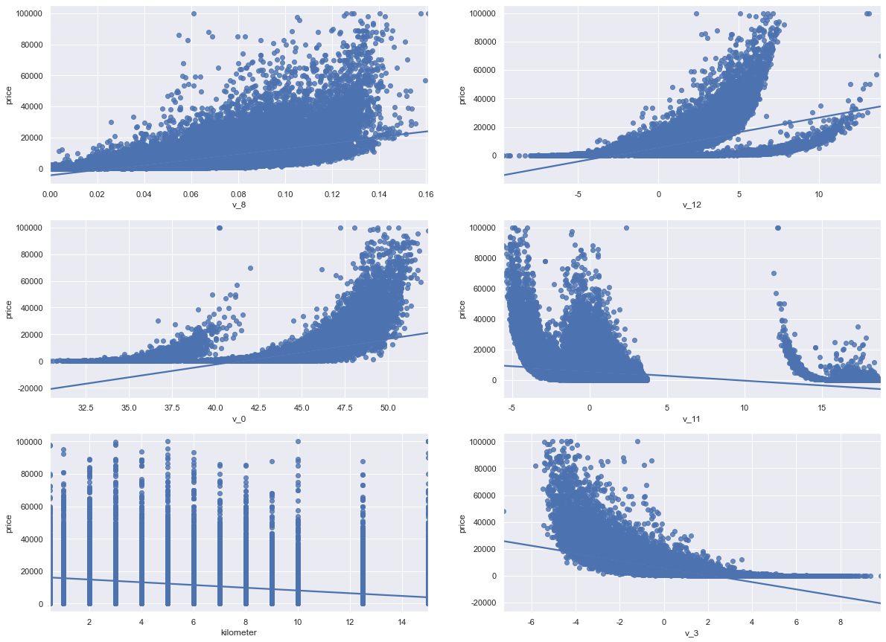

```python
import warnings
warnings.filterwarnings('ignore')
import os
from zipfile import ZipFile
import pandas as pd
import numpy as np
import matplotlib.pyplot as plt
import seaborn as sns
sns.set_style('whitegrid')
import missingno as msno
%matplotlib inline

plt.rcParams['font.sans-serif'] = ['SimHei']  # 解决中文显示问题-设置字体为黑体
plt.rcParams['axes.unicode_minus'] = False  # 解决保存图像是负号'-'显示为方块的问题
sns.set(font='SimHei')  # 解决Seaborn中文显示问题
```

### 1. 读取数据


```python
def load_data(filename = 'used_car_train_20200313', sep = ' '):
    myzip=ZipFile('data/%s.zip'%filename)
    f = myzip.open('%s.csv'%filename)
    Train_data = pd.read_csv(f, sep=sep)
    f.close()
    myzip.close()
    return Train_data

Train_data = load_data('used_car_train_20200313')
Test_data = load_data('used_car_testA_20200313')
print(Train_data.shape, Test_data.shape)
```

    (150000, 31) (50000, 30)
    

### 2. 观察数据


```python
Train_data.head().append(Train_data.tail())
```


<div>
<style scoped>
    .dataframe tbody tr th:only-of-type {
        vertical-align: middle;
    }

    .dataframe tbody tr th {
        vertical-align: top;
    }

    .dataframe thead th {
        text-align: right;
    }
</style>
<table border="1" class="dataframe">
  <thead>
    <tr style="text-align: right;">
      <th></th>
      <th>SaleID</th>
      <th>name</th>
      <th>regDate</th>
      <th>model</th>
      <th>brand</th>
      <th>bodyType</th>
      <th>fuelType</th>
      <th>gearbox</th>
      <th>power</th>
      <th>kilometer</th>
      <th>...</th>
      <th>v_5</th>
      <th>v_6</th>
      <th>v_7</th>
      <th>v_8</th>
      <th>v_9</th>
      <th>v_10</th>
      <th>v_11</th>
      <th>v_12</th>
      <th>v_13</th>
      <th>v_14</th>
    </tr>
  </thead>
  <tbody>
    <tr>
      <th>0</th>
      <td>0</td>
      <td>736</td>
      <td>20040402</td>
      <td>30.0</td>
      <td>6</td>
      <td>1.0</td>
      <td>0.0</td>
      <td>0.0</td>
      <td>60</td>
      <td>12.5</td>
      <td>...</td>
      <td>0.235676</td>
      <td>0.101988</td>
      <td>0.129549</td>
      <td>0.022816</td>
      <td>0.097462</td>
      <td>-2.881803</td>
      <td>2.804097</td>
      <td>-2.420821</td>
      <td>0.795292</td>
      <td>0.914762</td>
    </tr>
    <tr>
      <th>1</th>
      <td>1</td>
      <td>2262</td>
      <td>20030301</td>
      <td>40.0</td>
      <td>1</td>
      <td>2.0</td>
      <td>0.0</td>
      <td>0.0</td>
      <td>0</td>
      <td>15.0</td>
      <td>...</td>
      <td>0.264777</td>
      <td>0.121004</td>
      <td>0.135731</td>
      <td>0.026597</td>
      <td>0.020582</td>
      <td>-4.900482</td>
      <td>2.096338</td>
      <td>-1.030483</td>
      <td>-1.722674</td>
      <td>0.245522</td>
    </tr>
    <tr>
      <th>2</th>
      <td>2</td>
      <td>14874</td>
      <td>20040403</td>
      <td>115.0</td>
      <td>15</td>
      <td>1.0</td>
      <td>0.0</td>
      <td>0.0</td>
      <td>163</td>
      <td>12.5</td>
      <td>...</td>
      <td>0.251410</td>
      <td>0.114912</td>
      <td>0.165147</td>
      <td>0.062173</td>
      <td>0.027075</td>
      <td>-4.846749</td>
      <td>1.803559</td>
      <td>1.565330</td>
      <td>-0.832687</td>
      <td>-0.229963</td>
    </tr>
    <tr>
      <th>3</th>
      <td>3</td>
      <td>71865</td>
      <td>19960908</td>
      <td>109.0</td>
      <td>10</td>
      <td>0.0</td>
      <td>0.0</td>
      <td>1.0</td>
      <td>193</td>
      <td>15.0</td>
      <td>...</td>
      <td>0.274293</td>
      <td>0.110300</td>
      <td>0.121964</td>
      <td>0.033395</td>
      <td>0.000000</td>
      <td>-4.509599</td>
      <td>1.285940</td>
      <td>-0.501868</td>
      <td>-2.438353</td>
      <td>-0.478699</td>
    </tr>
    <tr>
      <th>4</th>
      <td>4</td>
      <td>111080</td>
      <td>20120103</td>
      <td>110.0</td>
      <td>5</td>
      <td>1.0</td>
      <td>0.0</td>
      <td>0.0</td>
      <td>68</td>
      <td>5.0</td>
      <td>...</td>
      <td>0.228036</td>
      <td>0.073205</td>
      <td>0.091880</td>
      <td>0.078819</td>
      <td>0.121534</td>
      <td>-1.896240</td>
      <td>0.910783</td>
      <td>0.931110</td>
      <td>2.834518</td>
      <td>1.923482</td>
    </tr>
    <tr>
      <th>149995</th>
      <td>149995</td>
      <td>163978</td>
      <td>20000607</td>
      <td>121.0</td>
      <td>10</td>
      <td>4.0</td>
      <td>0.0</td>
      <td>1.0</td>
      <td>163</td>
      <td>15.0</td>
      <td>...</td>
      <td>0.280264</td>
      <td>0.000310</td>
      <td>0.048441</td>
      <td>0.071158</td>
      <td>0.019174</td>
      <td>1.988114</td>
      <td>-2.983973</td>
      <td>0.589167</td>
      <td>-1.304370</td>
      <td>-0.302592</td>
    </tr>
    <tr>
      <th>149996</th>
      <td>149996</td>
      <td>184535</td>
      <td>20091102</td>
      <td>116.0</td>
      <td>11</td>
      <td>0.0</td>
      <td>0.0</td>
      <td>0.0</td>
      <td>125</td>
      <td>10.0</td>
      <td>...</td>
      <td>0.253217</td>
      <td>0.000777</td>
      <td>0.084079</td>
      <td>0.099681</td>
      <td>0.079371</td>
      <td>1.839166</td>
      <td>-2.774615</td>
      <td>2.553994</td>
      <td>0.924196</td>
      <td>-0.272160</td>
    </tr>
    <tr>
      <th>149997</th>
      <td>149997</td>
      <td>147587</td>
      <td>20101003</td>
      <td>60.0</td>
      <td>11</td>
      <td>1.0</td>
      <td>1.0</td>
      <td>0.0</td>
      <td>90</td>
      <td>6.0</td>
      <td>...</td>
      <td>0.233353</td>
      <td>0.000705</td>
      <td>0.118872</td>
      <td>0.100118</td>
      <td>0.097914</td>
      <td>2.439812</td>
      <td>-1.630677</td>
      <td>2.290197</td>
      <td>1.891922</td>
      <td>0.414931</td>
    </tr>
    <tr>
      <th>149998</th>
      <td>149998</td>
      <td>45907</td>
      <td>20060312</td>
      <td>34.0</td>
      <td>10</td>
      <td>3.0</td>
      <td>1.0</td>
      <td>0.0</td>
      <td>156</td>
      <td>15.0</td>
      <td>...</td>
      <td>0.256369</td>
      <td>0.000252</td>
      <td>0.081479</td>
      <td>0.083558</td>
      <td>0.081498</td>
      <td>2.075380</td>
      <td>-2.633719</td>
      <td>1.414937</td>
      <td>0.431981</td>
      <td>-1.659014</td>
    </tr>
    <tr>
      <th>149999</th>
      <td>149999</td>
      <td>177672</td>
      <td>19990204</td>
      <td>19.0</td>
      <td>28</td>
      <td>6.0</td>
      <td>0.0</td>
      <td>1.0</td>
      <td>193</td>
      <td>12.5</td>
      <td>...</td>
      <td>0.284475</td>
      <td>0.000000</td>
      <td>0.040072</td>
      <td>0.062543</td>
      <td>0.025819</td>
      <td>1.978453</td>
      <td>-3.179913</td>
      <td>0.031724</td>
      <td>-1.483350</td>
      <td>-0.342674</td>
    </tr>
  </tbody>
</table>
<p>10 rows × 31 columns</p>
</div>


```python
Test_data.head().append(Test_data.tail())
```


<div>
<style scoped>
    .dataframe tbody tr th:only-of-type {
        vertical-align: middle;
    }

    .dataframe tbody tr th {
        vertical-align: top;
    }

    .dataframe thead th {
        text-align: right;
    }
</style>
<table border="1" class="dataframe">
  <thead>
    <tr style="text-align: right;">
      <th></th>
      <th>SaleID</th>
      <th>name</th>
      <th>regDate</th>
      <th>model</th>
      <th>brand</th>
      <th>bodyType</th>
      <th>fuelType</th>
      <th>gearbox</th>
      <th>power</th>
      <th>kilometer</th>
      <th>...</th>
      <th>v_5</th>
      <th>v_6</th>
      <th>v_7</th>
      <th>v_8</th>
      <th>v_9</th>
      <th>v_10</th>
      <th>v_11</th>
      <th>v_12</th>
      <th>v_13</th>
      <th>v_14</th>
    </tr>
  </thead>
  <tbody>
    <tr>
      <th>0</th>
      <td>150000</td>
      <td>66932</td>
      <td>20111212</td>
      <td>222.0</td>
      <td>4</td>
      <td>5.0</td>
      <td>1.0</td>
      <td>1.0</td>
      <td>313</td>
      <td>15.0</td>
      <td>...</td>
      <td>0.264405</td>
      <td>0.121800</td>
      <td>0.070899</td>
      <td>0.106558</td>
      <td>0.078867</td>
      <td>-7.050969</td>
      <td>-0.854626</td>
      <td>4.800151</td>
      <td>0.620011</td>
      <td>-3.664654</td>
    </tr>
    <tr>
      <th>1</th>
      <td>150001</td>
      <td>174960</td>
      <td>19990211</td>
      <td>19.0</td>
      <td>21</td>
      <td>0.0</td>
      <td>0.0</td>
      <td>0.0</td>
      <td>75</td>
      <td>12.5</td>
      <td>...</td>
      <td>0.261745</td>
      <td>0.000000</td>
      <td>0.096733</td>
      <td>0.013705</td>
      <td>0.052383</td>
      <td>3.679418</td>
      <td>-0.729039</td>
      <td>-3.796107</td>
      <td>-1.541230</td>
      <td>-0.757055</td>
    </tr>
    <tr>
      <th>2</th>
      <td>150002</td>
      <td>5356</td>
      <td>20090304</td>
      <td>82.0</td>
      <td>21</td>
      <td>0.0</td>
      <td>0.0</td>
      <td>0.0</td>
      <td>109</td>
      <td>7.0</td>
      <td>...</td>
      <td>0.260216</td>
      <td>0.112081</td>
      <td>0.078082</td>
      <td>0.062078</td>
      <td>0.050540</td>
      <td>-4.926690</td>
      <td>1.001106</td>
      <td>0.826562</td>
      <td>0.138226</td>
      <td>0.754033</td>
    </tr>
    <tr>
      <th>3</th>
      <td>150003</td>
      <td>50688</td>
      <td>20100405</td>
      <td>0.0</td>
      <td>0</td>
      <td>0.0</td>
      <td>0.0</td>
      <td>1.0</td>
      <td>160</td>
      <td>7.0</td>
      <td>...</td>
      <td>0.260466</td>
      <td>0.106727</td>
      <td>0.081146</td>
      <td>0.075971</td>
      <td>0.048268</td>
      <td>-4.864637</td>
      <td>0.505493</td>
      <td>1.870379</td>
      <td>0.366038</td>
      <td>1.312775</td>
    </tr>
    <tr>
      <th>4</th>
      <td>150004</td>
      <td>161428</td>
      <td>19970703</td>
      <td>26.0</td>
      <td>14</td>
      <td>2.0</td>
      <td>0.0</td>
      <td>0.0</td>
      <td>75</td>
      <td>15.0</td>
      <td>...</td>
      <td>0.250999</td>
      <td>0.000000</td>
      <td>0.077806</td>
      <td>0.028600</td>
      <td>0.081709</td>
      <td>3.616475</td>
      <td>-0.673236</td>
      <td>-3.197685</td>
      <td>-0.025678</td>
      <td>-0.101290</td>
    </tr>
    <tr>
      <th>49995</th>
      <td>199995</td>
      <td>20903</td>
      <td>19960503</td>
      <td>4.0</td>
      <td>4</td>
      <td>4.0</td>
      <td>0.0</td>
      <td>0.0</td>
      <td>116</td>
      <td>15.0</td>
      <td>...</td>
      <td>0.284664</td>
      <td>0.130044</td>
      <td>0.049833</td>
      <td>0.028807</td>
      <td>0.004616</td>
      <td>-5.978511</td>
      <td>1.303174</td>
      <td>-1.207191</td>
      <td>-1.981240</td>
      <td>-0.357695</td>
    </tr>
    <tr>
      <th>49996</th>
      <td>199996</td>
      <td>708</td>
      <td>19991011</td>
      <td>0.0</td>
      <td>0</td>
      <td>0.0</td>
      <td>0.0</td>
      <td>0.0</td>
      <td>75</td>
      <td>15.0</td>
      <td>...</td>
      <td>0.268101</td>
      <td>0.108095</td>
      <td>0.066039</td>
      <td>0.025468</td>
      <td>0.025971</td>
      <td>-3.913825</td>
      <td>1.759524</td>
      <td>-2.075658</td>
      <td>-1.154847</td>
      <td>0.169073</td>
    </tr>
    <tr>
      <th>49997</th>
      <td>199997</td>
      <td>6693</td>
      <td>20040412</td>
      <td>49.0</td>
      <td>1</td>
      <td>0.0</td>
      <td>1.0</td>
      <td>1.0</td>
      <td>224</td>
      <td>15.0</td>
      <td>...</td>
      <td>0.269432</td>
      <td>0.105724</td>
      <td>0.117652</td>
      <td>0.057479</td>
      <td>0.015669</td>
      <td>-4.639065</td>
      <td>0.654713</td>
      <td>1.137756</td>
      <td>-1.390531</td>
      <td>0.254420</td>
    </tr>
    <tr>
      <th>49998</th>
      <td>199998</td>
      <td>96900</td>
      <td>20020008</td>
      <td>27.0</td>
      <td>1</td>
      <td>0.0</td>
      <td>0.0</td>
      <td>1.0</td>
      <td>334</td>
      <td>15.0</td>
      <td>...</td>
      <td>0.261152</td>
      <td>0.000490</td>
      <td>0.137366</td>
      <td>0.086216</td>
      <td>0.051383</td>
      <td>1.833504</td>
      <td>-2.828687</td>
      <td>2.465630</td>
      <td>-0.911682</td>
      <td>-2.057353</td>
    </tr>
    <tr>
      <th>49999</th>
      <td>199999</td>
      <td>193384</td>
      <td>20041109</td>
      <td>166.0</td>
      <td>6</td>
      <td>1.0</td>
      <td>NaN</td>
      <td>1.0</td>
      <td>68</td>
      <td>9.0</td>
      <td>...</td>
      <td>0.228730</td>
      <td>0.000300</td>
      <td>0.103534</td>
      <td>0.080625</td>
      <td>0.124264</td>
      <td>2.914571</td>
      <td>-1.135270</td>
      <td>0.547628</td>
      <td>2.094057</td>
      <td>-1.552150</td>
    </tr>
  </tbody>
</table>
<p>10 rows × 30 columns</p>
</div>


#### 2.1 数据总览


```python
Train_data.describe(include='object')
```


<div>
<style scoped>
    .dataframe tbody tr th:only-of-type {
        vertical-align: middle;
    }

    .dataframe tbody tr th {
        vertical-align: top;
    }

    .dataframe thead th {
        text-align: right;
    }
</style>
<table border="1" class="dataframe">
  <thead>
    <tr style="text-align: right;">
      <th></th>
      <th>notRepairedDamage</th>
    </tr>
  </thead>
  <tbody>
    <tr>
      <th>count</th>
      <td>150000</td>
    </tr>
    <tr>
      <th>unique</th>
      <td>3</td>
    </tr>
    <tr>
      <th>top</th>
      <td>0.0</td>
    </tr>
    <tr>
      <th>freq</th>
      <td>111361</td>
    </tr>
  </tbody>
</table>
</div>


```python
pd.set_option('display.max_columns', None)
Train_data.describe()
```


<div>
<style scoped>
    .dataframe tbody tr th:only-of-type {
        vertical-align: middle;
    }

    .dataframe tbody tr th {
        vertical-align: top;
    }

    .dataframe thead th {
        text-align: right;
    }
</style>
<table border="1" class="dataframe">
  <thead>
    <tr style="text-align: right;">
      <th></th>
      <th>SaleID</th>
      <th>name</th>
      <th>regDate</th>
      <th>model</th>
      <th>brand</th>
      <th>bodyType</th>
      <th>fuelType</th>
      <th>gearbox</th>
      <th>power</th>
      <th>kilometer</th>
      <th>regionCode</th>
      <th>seller</th>
      <th>offerType</th>
      <th>creatDate</th>
      <th>price</th>
      <th>v_0</th>
      <th>v_1</th>
      <th>v_2</th>
      <th>v_3</th>
      <th>v_4</th>
      <th>v_5</th>
      <th>v_6</th>
      <th>v_7</th>
      <th>v_8</th>
      <th>v_9</th>
      <th>v_10</th>
      <th>v_11</th>
      <th>v_12</th>
      <th>v_13</th>
      <th>v_14</th>
    </tr>
  </thead>
  <tbody>
    <tr>
      <th>count</th>
      <td>150000.000000</td>
      <td>150000.000000</td>
      <td>1.500000e+05</td>
      <td>149999.000000</td>
      <td>150000.000000</td>
      <td>145494.000000</td>
      <td>141320.000000</td>
      <td>144019.000000</td>
      <td>150000.000000</td>
      <td>150000.000000</td>
      <td>150000.000000</td>
      <td>150000.000000</td>
      <td>150000.0</td>
      <td>1.500000e+05</td>
      <td>150000.000000</td>
      <td>150000.000000</td>
      <td>150000.000000</td>
      <td>150000.000000</td>
      <td>150000.000000</td>
      <td>150000.000000</td>
      <td>150000.000000</td>
      <td>150000.000000</td>
      <td>150000.000000</td>
      <td>150000.000000</td>
      <td>150000.000000</td>
      <td>150000.000000</td>
      <td>150000.000000</td>
      <td>150000.000000</td>
      <td>150000.000000</td>
      <td>150000.000000</td>
    </tr>
    <tr>
      <th>mean</th>
      <td>74999.500000</td>
      <td>68349.172873</td>
      <td>2.003417e+07</td>
      <td>47.129021</td>
      <td>8.052733</td>
      <td>1.792369</td>
      <td>0.375842</td>
      <td>0.224943</td>
      <td>119.316547</td>
      <td>12.597160</td>
      <td>2583.077267</td>
      <td>0.000007</td>
      <td>0.0</td>
      <td>2.016033e+07</td>
      <td>5923.327333</td>
      <td>44.406268</td>
      <td>-0.044809</td>
      <td>0.080765</td>
      <td>0.078833</td>
      <td>0.017875</td>
      <td>0.248204</td>
      <td>0.044923</td>
      <td>0.124692</td>
      <td>0.058144</td>
      <td>0.061996</td>
      <td>-0.001000</td>
      <td>0.009035</td>
      <td>0.004813</td>
      <td>0.000313</td>
      <td>-0.000688</td>
    </tr>
    <tr>
      <th>std</th>
      <td>43301.414527</td>
      <td>61103.875095</td>
      <td>5.364988e+04</td>
      <td>49.536040</td>
      <td>7.864956</td>
      <td>1.760640</td>
      <td>0.548677</td>
      <td>0.417546</td>
      <td>177.168419</td>
      <td>3.919576</td>
      <td>1885.363218</td>
      <td>0.002582</td>
      <td>0.0</td>
      <td>1.067328e+02</td>
      <td>7501.998477</td>
      <td>2.457548</td>
      <td>3.641893</td>
      <td>2.929618</td>
      <td>2.026514</td>
      <td>1.193661</td>
      <td>0.045804</td>
      <td>0.051743</td>
      <td>0.201410</td>
      <td>0.029186</td>
      <td>0.035692</td>
      <td>3.772386</td>
      <td>3.286071</td>
      <td>2.517478</td>
      <td>1.288988</td>
      <td>1.038685</td>
    </tr>
    <tr>
      <th>min</th>
      <td>0.000000</td>
      <td>0.000000</td>
      <td>1.991000e+07</td>
      <td>0.000000</td>
      <td>0.000000</td>
      <td>0.000000</td>
      <td>0.000000</td>
      <td>0.000000</td>
      <td>0.000000</td>
      <td>0.500000</td>
      <td>0.000000</td>
      <td>0.000000</td>
      <td>0.0</td>
      <td>2.015062e+07</td>
      <td>11.000000</td>
      <td>30.451976</td>
      <td>-4.295589</td>
      <td>-4.470671</td>
      <td>-7.275037</td>
      <td>-4.364565</td>
      <td>0.000000</td>
      <td>0.000000</td>
      <td>0.000000</td>
      <td>0.000000</td>
      <td>0.000000</td>
      <td>-9.168192</td>
      <td>-5.558207</td>
      <td>-9.639552</td>
      <td>-4.153899</td>
      <td>-6.546556</td>
    </tr>
    <tr>
      <th>25%</th>
      <td>37499.750000</td>
      <td>11156.000000</td>
      <td>1.999091e+07</td>
      <td>10.000000</td>
      <td>1.000000</td>
      <td>0.000000</td>
      <td>0.000000</td>
      <td>0.000000</td>
      <td>75.000000</td>
      <td>12.500000</td>
      <td>1018.000000</td>
      <td>0.000000</td>
      <td>0.0</td>
      <td>2.016031e+07</td>
      <td>1300.000000</td>
      <td>43.135799</td>
      <td>-3.192349</td>
      <td>-0.970671</td>
      <td>-1.462580</td>
      <td>-0.921191</td>
      <td>0.243615</td>
      <td>0.000038</td>
      <td>0.062474</td>
      <td>0.035334</td>
      <td>0.033930</td>
      <td>-3.722303</td>
      <td>-1.951543</td>
      <td>-1.871846</td>
      <td>-1.057789</td>
      <td>-0.437034</td>
    </tr>
    <tr>
      <th>50%</th>
      <td>74999.500000</td>
      <td>51638.000000</td>
      <td>2.003091e+07</td>
      <td>30.000000</td>
      <td>6.000000</td>
      <td>1.000000</td>
      <td>0.000000</td>
      <td>0.000000</td>
      <td>110.000000</td>
      <td>15.000000</td>
      <td>2196.000000</td>
      <td>0.000000</td>
      <td>0.0</td>
      <td>2.016032e+07</td>
      <td>3250.000000</td>
      <td>44.610266</td>
      <td>-3.052671</td>
      <td>-0.382947</td>
      <td>0.099722</td>
      <td>-0.075910</td>
      <td>0.257798</td>
      <td>0.000812</td>
      <td>0.095866</td>
      <td>0.057014</td>
      <td>0.058484</td>
      <td>1.624076</td>
      <td>-0.358053</td>
      <td>-0.130753</td>
      <td>-0.036245</td>
      <td>0.141246</td>
    </tr>
    <tr>
      <th>75%</th>
      <td>112499.250000</td>
      <td>118841.250000</td>
      <td>2.007111e+07</td>
      <td>66.000000</td>
      <td>13.000000</td>
      <td>3.000000</td>
      <td>1.000000</td>
      <td>0.000000</td>
      <td>150.000000</td>
      <td>15.000000</td>
      <td>3843.000000</td>
      <td>0.000000</td>
      <td>0.0</td>
      <td>2.016033e+07</td>
      <td>7700.000000</td>
      <td>46.004721</td>
      <td>4.000670</td>
      <td>0.241335</td>
      <td>1.565838</td>
      <td>0.868758</td>
      <td>0.265297</td>
      <td>0.102009</td>
      <td>0.125243</td>
      <td>0.079382</td>
      <td>0.087491</td>
      <td>2.844357</td>
      <td>1.255022</td>
      <td>1.776933</td>
      <td>0.942813</td>
      <td>0.680378</td>
    </tr>
    <tr>
      <th>max</th>
      <td>149999.000000</td>
      <td>196812.000000</td>
      <td>2.015121e+07</td>
      <td>247.000000</td>
      <td>39.000000</td>
      <td>7.000000</td>
      <td>6.000000</td>
      <td>1.000000</td>
      <td>19312.000000</td>
      <td>15.000000</td>
      <td>8120.000000</td>
      <td>1.000000</td>
      <td>0.0</td>
      <td>2.016041e+07</td>
      <td>99999.000000</td>
      <td>52.304178</td>
      <td>7.320308</td>
      <td>19.035496</td>
      <td>9.854702</td>
      <td>6.829352</td>
      <td>0.291838</td>
      <td>0.151420</td>
      <td>1.404936</td>
      <td>0.160791</td>
      <td>0.222787</td>
      <td>12.357011</td>
      <td>18.819042</td>
      <td>13.847792</td>
      <td>11.147669</td>
      <td>8.658418</td>
    </tr>
  </tbody>
</table>
</div>


```python
Train_data.info()
```

    <class 'pandas.core.frame.DataFrame'>
    RangeIndex: 150000 entries, 0 to 149999
    Data columns (total 31 columns):
     #   Column             Non-Null Count   Dtype  
    ---  ------             --------------   -----  
     0   SaleID             150000 non-null  int64  
     1   name               150000 non-null  int64  
     2   regDate            150000 non-null  int64  
     3   model              149999 non-null  float64
     4   brand              150000 non-null  int64  
     5   bodyType           145494 non-null  float64
     6   fuelType           141320 non-null  float64
     7   gearbox            144019 non-null  float64
     8   power              150000 non-null  int64  
     9   kilometer          150000 non-null  float64
     10  notRepairedDamage  150000 non-null  object 
     11  regionCode         150000 non-null  int64  
     12  seller             150000 non-null  int64  
     13  offerType          150000 non-null  int64  
     14  creatDate          150000 non-null  int64  
     15  price              150000 non-null  int64  
     16  v_0                150000 non-null  float64
     17  v_1                150000 non-null  float64
     18  v_2                150000 non-null  float64
     19  v_3                150000 non-null  float64
     20  v_4                150000 non-null  float64
     21  v_5                150000 non-null  float64
     22  v_6                150000 non-null  float64
     23  v_7                150000 non-null  float64
     24  v_8                150000 non-null  float64
     25  v_9                150000 non-null  float64
     26  v_10               150000 non-null  float64
     27  v_11               150000 non-null  float64
     28  v_12               150000 non-null  float64
     29  v_13               150000 non-null  float64
     30  v_14               150000 non-null  float64
    dtypes: float64(20), int64(10), object(1)
    memory usage: 35.5+ MB
    

#### 2.2 缺失值分析


```python
# nan可视化
Train_missing = Train_data.isna().sum()[Train_data.isna().sum()>0].sort_values(ascending=False).reset_index()
Train_missing.columns = ['features','missing_num']

sns.set()
sns.barplot(x = 'features', y = 'missing_num', data = Train_missing)
x = range(len(Train_missing))
y = Train_missing.missing_num.tolist()
for x_i, y_i in zip(x, y):
    plt.text(x_i - 0.1, y_i + 200, '{:.0f}'.format(y_i))#.set_backgroundcolor('#965786')
```


    

    


```python
# nan可视化
Test_missing = Test_data.isna().sum()[Test_data.isna().sum()>0].sort_values(ascending=False).reset_index()
Test_missing.columns = ['features','missing_num']

sns.set()
sns.barplot(x = 'features', y = 'missing_num', data = Test_missing)
x = range(len(Test_missing))
y = Test_missing.missing_num.tolist()
for x_i, y_i in zip(x, y):
    plt.text(x_i - 0.1, y_i + 100, '{:.0f}'.format(y_i))#.set_backgroundcolor('#965786')
```


    

    


```python
# 可视化看下缺省值
msno.matrix(Train_data.sample(250))
```


    <AxesSubplot:>


    

    


```python
msno.bar(Train_data.sample(1000))
```


    <AxesSubplot:>


    

    


```python
Train_data['notRepairedDamage'].value_counts()
```


    0.0    111361
    -       24324
    1.0     14315
    Name: notRepairedDamage, dtype: int64


```python
Train_data['notRepairedDamage'].replace('-', np.nan, inplace=True)
Train_data['notRepairedDamage'].value_counts()
```


    0.0    111361
    1.0     14315
    Name: notRepairedDamage, dtype: int64


```python
Test_data['notRepairedDamage'].replace('-', np.nan, inplace=True)
Test_data['notRepairedDamage'].value_counts()
```


    0.0    37249
    1.0     4720
    Name: notRepairedDamage, dtype: int64


以下两个类别特征严重倾斜，一般不会对预测有什么帮助，故这边先删掉，当然你也可以继续挖掘，但是一般意义不大


```python
Train_data["seller"].value_counts()
```


    0    149999
    1         1
    Name: seller, dtype: int64


```python
Train_data["offerType"].value_counts()
```


    0    150000
    Name: offerType, dtype: int64


```python
del Train_data["seller"]
del Train_data["offerType"]
del Test_data["seller"]
del Test_data["offerType"]
```

#### 2.3 了解数据分布


```python
## 1) 总体分布概况（无界约翰逊分布等）
import scipy.stats as st
y = Train_data['price']
plt.figure(1); plt.title('Johnson SU')
sns.distplot(y, kde=False, fit=st.johnsonsu)
plt.figure(2); plt.title('Normal')
sns.distplot(y, kde=False, fit=st.norm)
plt.figure(3); plt.title('Log Normal')
sns.distplot(y, kde=False, fit=st.lognorm)
```


    <AxesSubplot:title={'center':'Log Normal'}, xlabel='price'>


    

    


    

    


    

    


价格不服从正态分布，所以在进行回归之前，它必须进行转换。虽然对数变换做得很好，但最佳拟合是无界约翰逊分布


```python
## 2) 查看skewness and kurtosis
sns.distplot(Train_data['price']);
print("Skewness: %f" % Train_data['price'].skew())
print("Kurtosis: %f" % Train_data['price'].kurt())
```

    Skewness: 3.346487
    Kurtosis: 18.995183
    


    

    


```python
# 偏度
sns.distplot(Train_data.skew(),color='blue',axlabel ='Skewness')
```


    <AxesSubplot:xlabel='Skewness', ylabel='Density'>


    

    


```python
# 峰度
sns.distplot(Train_data.kurt(),color='orange',axlabel ='Kurtness')
```


    <AxesSubplot:xlabel='Kurtness', ylabel='Density'>


    

    


```python
## 3) 查看预测值的具体频数
plt.hist(Train_data['price'], orientation = 'vertical',histtype = 'bar', color ='red');
```


    

    


查看频数, 大于20000得值极少，其实这里也可以把这些当作特殊得值（异常值）直接用填充或者删掉，再前面进行


```python
# log变换 z之后的分布较均匀，可以进行log变换进行预测，这也是预测问题常用的trick
plt.hist(np.log(Train_data['price']), orientation = 'vertical',histtype = 'bar', color ='red');
```


    

    


#### 2.4 特征分为类别特征和数字特征，并对类别特征查看unique分布
##### 2.4.1 类别特征

**列**

* name - 汽车编码
* regDate - 汽车注册时间
* model - 车型编码
* brand - 品牌
* bodyType - 车身类型
* fuelType - 燃油类型
* gearbox - 变速箱
* power - 汽车功率
* kilometer - 汽车行驶公里
* notRepairedDamage - 汽车有尚未修复的损坏
* regionCode - 看车地区编码
* seller - 销售方 【以删】
* offerType - 报价类型 【以删】
* creatDate - 广告发布时间
* price - 汽车价格
* v_0', 'v_1', 'v_2', 'v_3', 'v_4', 'v_5', 'v_6', 'v_7', 'v_8', 'v_9', 'v_10', 'v_11', 'v_12', 'v_13','v_14'（根据汽车的评论、标签等大量信息得到的embedding向量）【人工构造 匿名特征】


```python
# feature_name
feature_name={'name':'汽车编码',
'regDate':'汽车注册时间',
'model':'车型编码',
'brand':'品牌',
'bodyType':'车身类型',
'fuelType':'燃油类型',
'gearbox':'变速箱',
'power':'汽车功率',
'kilometer':'汽车行驶公里',
'notRepairedDamage':'汽车有尚未修复的损坏',
'regionCode':'看车地区编码',
'seller':'销售方 【以删】',
'offerType':'报价类型 【以删】',
'creatDate':'广告发布时间',
'price':'汽车价格'}
```


```python
# 分离label即预测值
Y_train = Train_data['price']
```


```python
numeric_features = ['power', 'kilometer', 'v_0', 'v_1', 'v_2', 'v_3', 'v_4', 'v_5', 'v_6', 'v_7', 'v_8', 'v_9',
                    'v_10', 'v_11', 'v_12', 'v_13','v_14' ]

categorical_features = ['name', 'model', 'brand', 'bodyType', 'fuelType', 'gearbox', 'notRepairedDamage', 'regionCode',]
```


```python
# 特征nunique分布
for cat_fea in categorical_features:
    print(cat_fea + "的特征分布如下：")
    print("{}特征有个 [{}] 不同的值".format(cat_fea, Train_data[cat_fea].nunique()))
    print(Train_data[cat_fea].value_counts(),'\n')
```

    name的特征分布如下：
    name特征有个 [99662] 不同的值
    708       282
    387       282
    55        280
    1541      263
    203       233
             ... 
    5074        1
    7123        1
    11221       1
    13270       1
    174485      1
    Name: name, Length: 99662, dtype: int64 
    
    model的特征分布如下：
    model特征有个 [248] 不同的值
    0.0      11762
    19.0      9573
    4.0       8445
    1.0       6038
    29.0      5186
             ...  
    245.0        2
    209.0        2
    240.0        2
    242.0        2
    247.0        1
    Name: model, Length: 248, dtype: int64 
    
    brand的特征分布如下：
    brand特征有个 [40] 不同的值
    0     31480
    4     16737
    14    16089
    10    14249
    1     13794
    6     10217
    9      7306
    5      4665
    13     3817
    11     2945
    3      2461
    7      2361
    16     2223
    8      2077
    25     2064
    27     2053
    21     1547
    15     1458
    19     1388
    20     1236
    12     1109
    22     1085
    26      966
    30      940
    17      913
    24      772
    28      649
    32      592
    29      406
    37      333
    2       321
    31      318
    18      316
    36      228
    34      227
    33      218
    23      186
    35      180
    38       65
    39        9
    Name: brand, dtype: int64 
    
    bodyType的特征分布如下：
    bodyType特征有个 [8] 不同的值
    0.0    41420
    1.0    35272
    2.0    30324
    3.0    13491
    4.0     9609
    5.0     7607
    6.0     6482
    7.0     1289
    Name: bodyType, dtype: int64 
    
    fuelType的特征分布如下：
    fuelType特征有个 [7] 不同的值
    0.0    91656
    1.0    46991
    2.0     2212
    3.0      262
    4.0      118
    5.0       45
    6.0       36
    Name: fuelType, dtype: int64 
    
    gearbox的特征分布如下：
    gearbox特征有个 [2] 不同的值
    0.0    111623
    1.0     32396
    Name: gearbox, dtype: int64 
    
    notRepairedDamage的特征分布如下：
    notRepairedDamage特征有个 [2] 不同的值
    0.0    111361
    1.0     14315
    Name: notRepairedDamage, dtype: int64 
    
    regionCode的特征分布如下：
    regionCode特征有个 [7905] 不同的值
    419     369
    764     258
    125     137
    176     136
    462     134
           ... 
    6414      1
    7063      1
    4239      1
    5931      1
    7267      1
    Name: regionCode, Length: 7905, dtype: int64 
    
    


```python
# 特征值取值数量对比
features_num = sorted(zip(categorical_features, map(lambda cat_fea:Train_data[cat_fea].nunique(), categorical_features)),
                      key = lambda x:x[1], reverse = True)

x, y = ['%s(%s)'%(k, feature_name.get(k,'')) for k,v in features_num], [v for k,v in features_num]
sns.set(font='SimHei')
sns.barplot(x = y, y = x, orient = 'h')
for x_i, y_i in zip(range(len(x)), y):
    plt.text(y_i + 100, x_i, '{:.0f}'.format(y_i))#.set_backgroundcolor('#965786')
```


    

    


##### 2.4.2 数字特征


```python
numeric_features.append('price')

## 1) 相关性分析
price_numeric = Train_data[numeric_features]
correlation = price_numeric.corr()
correlation = correlation.applymap(lambda x:round(x,1))
print(correlation['price'].sort_values(ascending = False),'\n')
```

    price        1.0
    v_8          0.7
    v_12         0.7
    v_0          0.6
    v_5          0.2
    power        0.2
    v_2          0.1
    v_1          0.1
    v_6          0.1
    v_14         0.0
    v_13        -0.0
    v_7         -0.1
    v_4         -0.1
    v_9         -0.2
    v_10        -0.2
    v_11        -0.3
    kilometer   -0.4
    v_3         -0.7
    Name: price, dtype: float64 
    
    


```python
fig, ax = plt.subplots(figsize=(10, 10))
sns.heatmap(correlation, annot=True, #vmax=1, vmin=-1,
                xticklabels=True,
                yticklabels=True, square=True)# cmap="YlGnBu")
```


    <AxesSubplot:>


    

    


```python
del price_numeric['price']

## 2) 查看几个特征得 偏度和峰值
for col in numeric_features:
    print('{:15}'.format(col), 
          'Skewness: {:05.2f}'.format(Train_data[col].skew()) , 
          '   ' ,
          'Kurtosis: {:06.2f}'.format(Train_data[col].kurt())  
         )
```

    power           Skewness: 65.86     Kurtosis: 5733.45
    kilometer       Skewness: -1.53     Kurtosis: 001.14
    v_0             Skewness: -1.32     Kurtosis: 003.99
    v_1             Skewness: 00.36     Kurtosis: -01.75
    v_2             Skewness: 04.84     Kurtosis: 023.86
    v_3             Skewness: 00.11     Kurtosis: -00.42
    v_4             Skewness: 00.37     Kurtosis: -00.20
    v_5             Skewness: -4.74     Kurtosis: 022.93
    v_6             Skewness: 00.37     Kurtosis: -01.74
    v_7             Skewness: 05.13     Kurtosis: 025.85
    v_8             Skewness: 00.20     Kurtosis: -00.64
    v_9             Skewness: 00.42     Kurtosis: -00.32
    v_10            Skewness: 00.03     Kurtosis: -00.58
    v_11            Skewness: 03.03     Kurtosis: 012.57
    v_12            Skewness: 00.37     Kurtosis: 000.27
    v_13            Skewness: 00.27     Kurtosis: -00.44
    v_14            Skewness: -1.19     Kurtosis: 002.39
    price           Skewness: 03.35     Kurtosis: 019.00
    


```python
## 3) 每个数字特征得分布可视化
f = pd.melt(Train_data, value_vars=numeric_features)
g = sns.FacetGrid(f, col="variable",  col_wrap=2, sharex=False, sharey=False)
g = g.map(sns.distplot, "value")
```


    

    


可以看出匿名特征相对分布均匀


```python
## 4) 数字特征相互之间的关系可视化
# 先找大相关性>0.3的变量(绝对值)
corr = correlation['price'].sort_values(ascending = False)
corr = corr[corr.apply(abs) >= 0.3]
sns.set()
columns = list(corr.index)
sns.pairplot(Train_data[columns],size = 2 ,kind ='scatter',diag_kind='kde')
```


    <seaborn.axisgrid.PairGrid at 0x26383f4b190>


    

    


此处是多变量之间的关系可视化


```python
corr.index
```


    Index(['price', 'v_8', 'v_12', 'v_0', 'v_11', 'kilometer', 'v_3'], dtype='object')


```python
## 5) 多变量互相回归关系可视化
fig, axes = plt.subplots(nrows=3, ncols=2, figsize=(20, 15))
# ['v_12', 'v_8' , 'v_0', 'power', 'v_5',  'v_2', 'v_6', 'v_1', 'v_14']
def regplot(x, ax):
    v_scatter_plot = pd.concat([Y_train, Train_data[x]],axis = 1)
    sns.regplot(x=x,y = 'price', data = v_scatter_plot, scatter= True, fit_reg=True, ax=ax)
    
for x, ax in zip(['v_8', 'v_12', 'v_0', 'v_11', 'kilometer', 'v_3'],
                [axes[0][0], axes[0][1], axes[1][0], axes[1][1], axes[2][0], axes[2][1]]):
    regplot(x, ax)
```


    

    


```python
## 2) 类别特征箱形图可视化

# 因为 name和 regionCode的类别太稀疏了，这里我们把不稀疏的几类画一下
categorical_features = ['model',
 'brand',
 'bodyType',
 'fuelType',
 'gearbox',
 'notRepairedDamage']
for c in categorical_features:
    Train_data[c] = Train_data[c].astype('category')
    if Train_data[c].isnull().any():
        Train_data[c] = Train_data[c].cat.add_categories(['MISSING'])
        Train_data[c] = Train_data[c].fillna('MISSING')

def boxplot(x, y, **kwargs):
    sns.boxplot(x=x, y=y)
    x=plt.xticks(rotation=90)

f = pd.melt(Train_data, id_vars=['price'], value_vars=categorical_features)
g = sns.FacetGrid(f, col="variable",  col_wrap=2, sharex=False, sharey=False, size=5)
g = g.map(boxplot, "value", "price")
```


    

    


```python
## 3) 类别特征的小提琴图可视化
catg_list = categorical_features
target = 'price'
for catg in catg_list :
    sns.violinplot(x=catg, y=target, data=Train_data)
    plt.show()
```


    

    


    

    


    

    


    

    


    

    


    

    


```python
## 4) 类别特征的柱形图可视化
def bar_plot(x, y, **kwargs):
    sns.barplot(x=x, y=y)
    x=plt.xticks(rotation=90)

f = pd.melt(Train_data, id_vars=['price'], value_vars=categorical_features)
g = sns.FacetGrid(f, col="variable",  col_wrap=2, sharex=False, sharey=False, size=5)
g = g.map(bar_plot, "value", "price")
```


    

    


```python
##  5) 类别特征的每个类别频数可视化(count_plot)
def count_plot(x,  **kwargs):
    sns.countplot(x=x)
    x=plt.xticks(rotation=90)

f = pd.melt(Train_data,  value_vars=categorical_features)
g = sns.FacetGrid(f, col="variable",  col_wrap=2, sharex=False, sharey=False, size=5)
g = g.map(count_plot, "value")
```


    

    


```python

```
